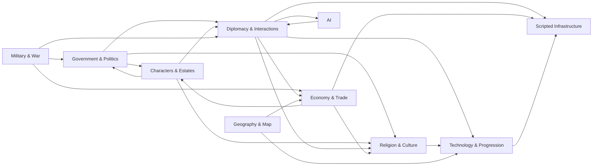

# Europa Universalis V — Game System Annotations

A reference library documenting EU5's script systems for modders. Each annotation explains how a game system works, what fields it exposes, and how it connects to other systems. All annotations verified against v1.1.10.

## Annotation System Map

Cross-cluster dependencies across the 80 annotated systems. Full edge data in [`annotations/_system_edges.json`](annotations/_system_edges.json).

## Annotations

80 systems documented across 10 clusters (Government & Politics, Military & War, Diplomacy & Interactions, Economy & Trade, Characters & Estates, Technology & Progression, Religion & Culture, Scripted Infrastructure, Geography & Map, AI).

Each annotation covers:
- what the system does and where its files live
- key fields and their accepted values
- how the system interacts with others
- modding notes and gotchas

**Start here:** [`annotations/GAME_STRUCTURE_GUIDE.md`](annotations/GAME_STRUCTURE_GUIDE.md) — full system index grouped by cluster, with links to every annotation.

Machine-readable metadata (stage, cluster, summary per system): [`annotations/_system_index.json`](annotations/_system_index.json)

## Repo Layout

| Path | Contents |
|---|---|
| `annotations/` | Vanilla system reference — 80 systems, v1.1.10 |
| `mod/` | Mod directories, each with `.metadata/` for mod-specific notes |

## Mods

| Mod | Description |
|---|---|
| `mod/better_piracy_workaround/` | Reduces pirate unit durability to manageable levels |
